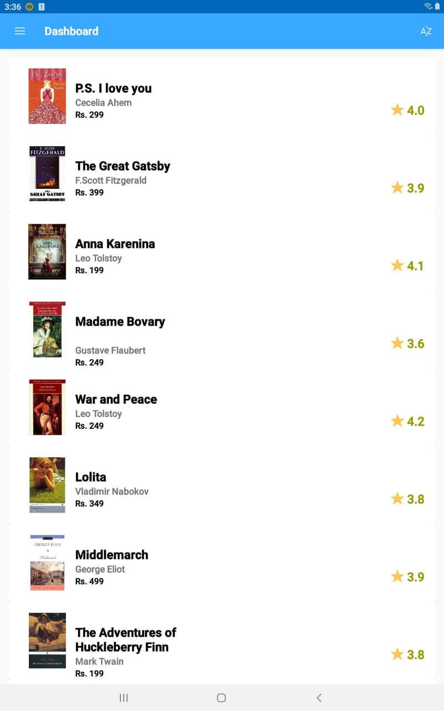
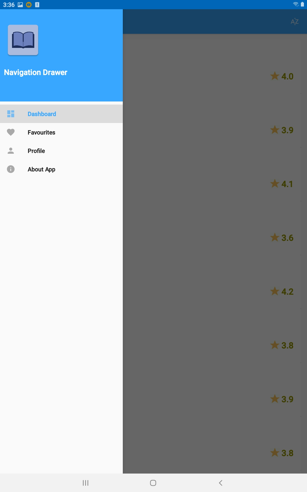
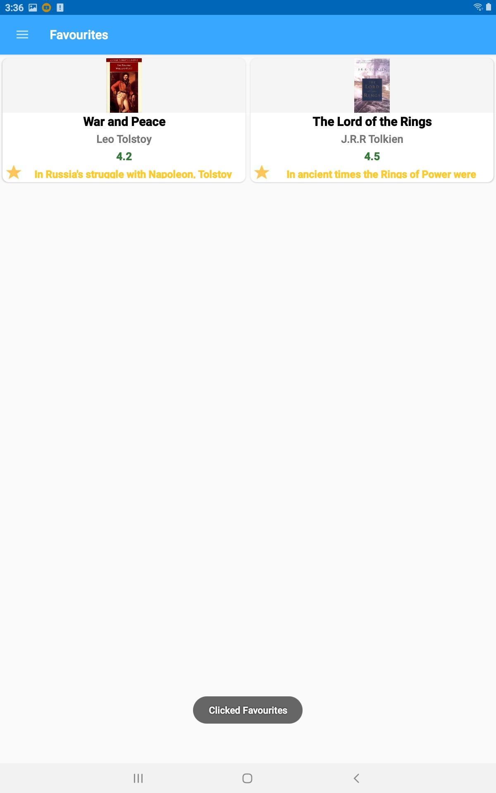
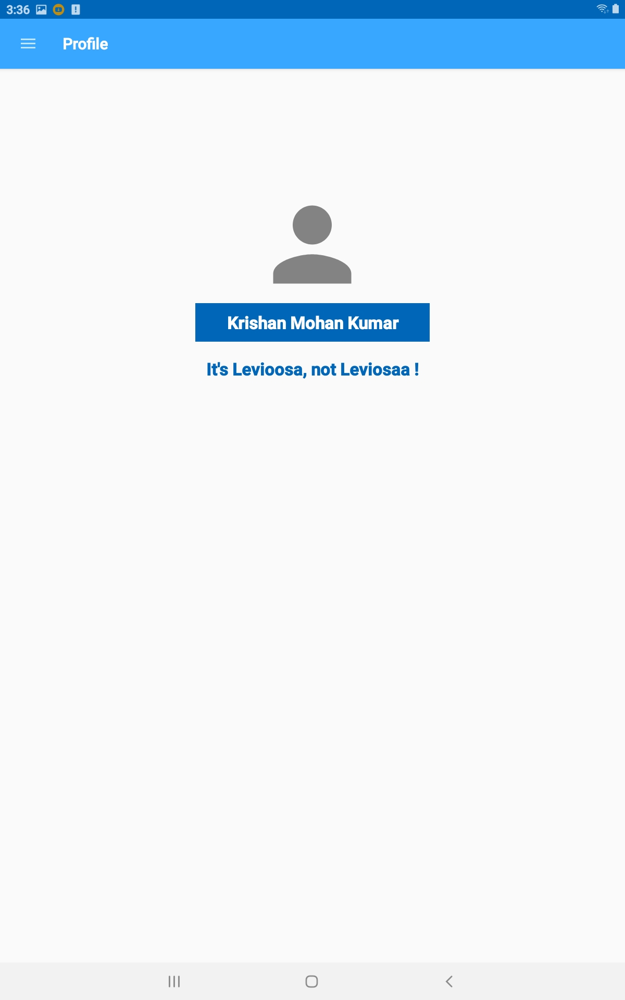

# BookHub

A basic Android app developed in Kotlin that fetches data from the internet, has a navigation drawer and makes use of fragments and activities.

The book list can be sorted using the button in the upper right corner. If two books have the same rating, they'll be shown an alphabetical order.

## Main Features
1.Volley Library 
2.Fragments and Lifecycles 
3.Favourites 
4.DBA AsyncTask for storing databases on the user's phone 

# Screenshot

 <table align="center">
  <tr>
     <td></td>
    <td></td>
    <td></td>
    <td></td>
  </tr>
   
</table>  

# Liked this repo, give it a star ⭐ and fork 🍽️ this repository to help others!!
